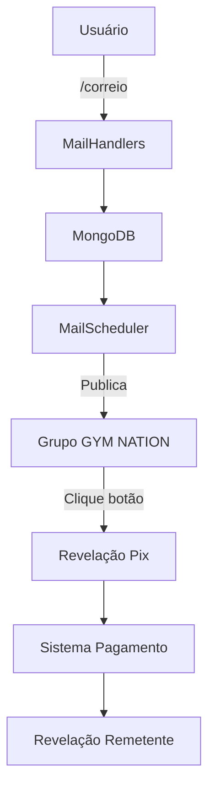

# 📬 Correio Elegante - Documentação Técnica

## Visão Geral

O **Correio Elegante** é uma funcionalidade que permite aos membros do grupo GYM NATION enviar mensagens anônimas uns para os outros, com opção de revelação do remetente mediante pagamento via Pix.

## Arquitetura

### Componentes Principais



### Fluxo de Dados

1. **Criação**: Usuário cria correio via chat privado
2. **Validação**: Sistema valida conteúdo e destinatário
3. **Armazenamento**: Correio salvo com status "pending"
4. **Publicação**: Agendador publica no grupo automaticamente
5. **Interação**: Membros podem revelar ou responder
6. **Expiração**: Correios expiram em 24h

## Estrutura do Banco de Dados

### Collection: `correio_elegante`

```javascript
{
  "_id": ObjectId,
  "sender_id": Number,           // ID do remetente
  "sender_name": String,         // Nome do remetente
  "recipient_username": String,  // Username do destinatário (sem @)
  "message_text": String,        // Texto da mensagem
  "status": String,              // "pending", "published", "expired"
  "created_at": Date,            // Data de criação
  "published_at": Date,          // Data de publicação
  "published_message_id": Number, // ID da mensagem no grupo
  "expires_at": Date,            // Data de expiração
  "revealed_to": [Number],       // IDs dos usuários que revelaram
  "reported_by": [               // Denúncias
    {
      "user_id": Number,
      "user_name": String,
      "reported_at": Date
    }
  ],
  "replies": [                   // Respostas anônimas
    {
      "reply_text": String,
      "sender_id": Number,
      "sender_name": String,
      "sent_at": Date
    }
  ]
}
```

### Collection: `pix_payments`

```javascript
{
  "_id": ObjectId,
  "pix_id": String,              // ID único do pagamento
  "user_id": Number,             // ID do usuário pagador
  "mail_id": String,             // ID do correio a ser revelado
  "amount": Number,              // Valor (2.00)
  "pix_key": String,             // Chave Pix
  "status": String,              // "pending", "confirmed", "expired"
  "created_at": Date,            // Data de criação
  "expires_at": Date,            // Data de expiração (30 min)
  "confirmed_at": Date           // Data de confirmação
}
```

## API Reference

### MailHandlers

#### Comandos Principais

```python
async def correio_command(update: Update, context: ContextTypes.DEFAULT_TYPE) -> int
```
- **Descrição**: Inicia processo de envio de correio
- **Restrições**: Apenas chat privado, limite 2/dia
- **Retorno**: Estado da conversação

```python
async def revelar_correio_command(update: Update, context: ContextTypes.DEFAULT_TYPE) -> None
```
- **Descrição**: Inicia processo de revelação via Pix
- **Parâmetros**: ID do correio
- **Restrições**: Apenas chat privado

```python
async def responder_correio_command(update: Update, context: ContextTypes.DEFAULT_TYPE) -> int
```
- **Descrição**: Inicia resposta anônima
- **Parâmetros**: ID do correio
- **Restrições**: Apenas chat privado

#### Métodos Auxiliares

```python
async def _contains_offensive_content(text: str) -> bool
```
- **Descrição**: Filtro básico de conteúdo ofensivo
- **Retorno**: True se contém conteúdo ofensivo

```python
async def _check_user_in_group(bot, chat_id: int, username: str) -> bool
```
- **Descrição**: Verifica se usuário está no grupo
- **Retorno**: True se é membro ativo

```python
async def _generate_pix_payment(user_id: int, mail_id: str) -> tuple
```
- **Descrição**: Gera chave Pix para pagamento
- **Retorno**: (pix_key, pix_id) ou (None, None)

### MongoDB Client

#### Métodos do Correio

```python
async def create_mail(sender_id: int, sender_name: str, 
                     recipient_username: str, message_text: str) -> Optional[str]
```

```python
async def get_daily_mail_count(user_id: int) -> int
```

```python
async def get_pending_mails() -> List[Dict[str, Any]]
```

```python
async def publish_mail(mail_id: str, published_message_id: int) -> bool
```

```python
async def get_mail_by_id(mail_id: str) -> Optional[Dict[str, Any]]
```

```python
async def reveal_mail(mail_id: str, user_id: int) -> Optional[Dict[str, Any]]
```

```python
async def report_mail(mail_id: str, user_id: int, user_name: str) -> bool
```

```python
async def send_mail_reply(mail_id: str, reply_text: str, 
                         sender_id: int, sender_name: str) -> bool
```

#### Métodos Pix

```python
async def create_pix_payment(pix_id: str, user_id: int, mail_id: str, 
                           amount: float, pix_key: str) -> bool
```

```python
async def get_pix_payment(pix_id: str) -> Optional[Dict[str, Any]]
```

```python
async def confirm_pix_payment(pix_id: str, user_id: int) -> bool
```

### MailScheduler

```python
class MailScheduler:
    async def start(self, interval_minutes: int = 60) -> None
    async def stop(self) -> None
    async def _process_pending_mails(self) -> None
    async def _publish_mail(self, mail: Dict[str, Any], chat_id: int) -> None
```

## Configuração

### Variáveis de Ambiente

```bash
# Chave Pix para pagamentos (OBRIGATÓRIO)
PIX_KEY=seu_cpf_ou_chave_pix_aqui

# Nome do grupo GYM NATION (opcional)
GYM_NATION_GROUP_NAME=GYM NATION
```

### Configuração no Config.py

```python
@staticmethod
def get_pix_key() -> str:
    """Obtém a chave Pix para pagamentos."""
    
@staticmethod
def get_gym_nation_group_name() -> str:
    """Obtém o nome do grupo GYM NATION."""
```

## Validações e Restrições

### Validações de Entrada

1. **Mensagem**:
   - Mínimo: 10 caracteres
   - Máximo: 500 caracteres
   - Filtro de conteúdo ofensivo

2. **Destinatário**:
   - Formato: @username
   - Deve ser membro do grupo GYM NATION
   - Verificação em tempo real

3. **Limite Diário**:
   - 2 correios por usuário por dia
   - Reset automático à meia-noite

### Restrições de Uso

1. **Chat Privado**: Comandos só funcionam em chat privado
2. **Membros Ativos**: Apenas membros do grupo podem usar
3. **Expiração**: Correios expiram em 24h
4. **Denúncias**: 3+ denúncias = remoção automática

## Sistema de Pagamento

### Fluxo Pix

1. **Geração**: Sistema gera chave Pix única
2. **Expiração**: 30 minutos para pagamento
3. **Confirmação**: Manual (temporário) ou automática (futuro)
4. **Revelação**: Após confirmação, remetente é revelado

### Estrutura do Pagamento

```python
pix_data = {
    "pix_id": f"PIX_{user_id}_{mail_id}_{timestamp}",
    "amount": 2.00,
    "pix_key": Config.get_pix_key(),
    "expires_at": datetime.now() + timedelta(minutes=30)
}
```

## Moderação

### Sistema de Denúncias

1. **Botão Denunciar**: Disponível em cada correio
2. **Limite**: 3 denúncias = remoção automática
3. **Log**: Todas as denúncias são registradas
4. **Notificação**: Admins são notificados (futuro)

### Filtros de Conteúdo

```python
offensive_words = [
    'merda', 'porra', 'caralho', 'puta', 'viado', 
    'idiota', 'burro', 'fdp', 'arrombado', 'desgraça', 
    'otário', 'babaca'
]
```

## Comandos Administrativos

### `/admincorreio`

```bash
/admincorreio status    # Status do sistema
/admincorreio stats     # Estatísticas
/admincorreio cleanup   # Limpeza
/admincorreio pending   # Correios pendentes
/admincorreio reports   # Denúncias
```

## Monitoramento e Logs

### Logs Importantes

```python
logger.info(f"Correio criado: ID {mail_id}")
logger.info(f"Correio {mail_id} publicado com sucesso")
logger.error(f"Erro ao publicar correio {mail_id}: {e}")
logger.warning(f"Agendador de correio já está em execução")
```

### Métricas (Futuro)

- Correios enviados por dia
- Taxa de revelação
- Arrecadação total
- Usuários mais ativos
- Denúncias por período

## Testes

### Estrutura de Testes

```python
class TestMailHandlers:
    async def test_contains_offensive_content()
    async def test_check_user_in_group_success()
    async def test_generate_pix_payment_success()
    async def test_correio_command_success()
    async def test_handle_mail_message_success()
```

### Executar Testes

```bash
pytest tests/test_mail_handlers.py -v
```

## Roadmap

### Versão Atual (v1.0)
- ✅ Envio de correios anônimos
- ✅ Publicação automática
- ✅ Sistema Pix básico
- ✅ Respostas anônimas
- ✅ Sistema de denúncias

### Próximas Versões

#### v1.1
- [ ] Webhook Pix automático
- [ ] Interface de moderação
- [ ] Estatísticas detalhadas
- [ ] Notificações para admins

#### v1.2
- [ ] Correios com imagens
- [ ] Sistema de categorias
- [ ] Agendamento de envio
- [ ] Histórico de correios

#### v1.3
- [ ] API REST para correios
- [ ] Dashboard web
- [ ] Relatórios avançados
- [ ] Integração com outros bots

## Troubleshooting

### Problemas Comuns

1. **Correios não são publicados**
   - Verificar se agendador está ativo
   - Verificar configuração do grupo GYM NATION
   - Verificar logs do scheduler

2. **Pix não funciona**
   - Verificar variável PIX_KEY
   - Verificar formato da chave
   - Verificar logs de pagamento

3. **Usuário não encontrado**
   - Verificar se username está correto
   - Verificar se usuário está no grupo
   - Verificar permissões do bot

### Debug

```python
# Verificar status do sistema
/admincorreio status

# Verificar correios pendentes
/admincorreio pending

# Verificar logs
tail -f logs/bot.log | grep -i correio
```

## Segurança

### Considerações

1. **Anonimato**: Remetente só é revelado após pagamento
2. **Validação**: Todos os inputs são validados
3. **Rate Limiting**: Limite de 2 correios/dia
4. **Moderação**: Sistema de denúncias ativo
5. **Expiração**: Correios expiram automaticamente

### Boas Práticas

1. Manter chave Pix segura
2. Monitorar denúncias regularmente
3. Fazer backup dos dados
4. Atualizar filtros de conteúdo
5. Revisar logs periodicamente 