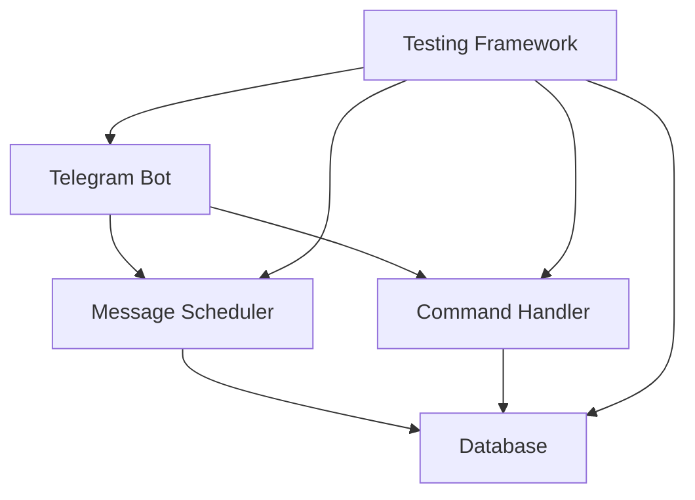

# System Patterns

## Architecture Overview
The system follows a modular architecture with clear separation of concerns:
- Bot Core: Handles Telegram API interactions
- Message Scheduler: Manages recurring messages
- Database Layer: Persists message data
- Testing Framework: Validates functionality
- Utilities: Helper functions and tools

## Key Technical Decisions
1. **Database Choice**: SQLite for simplicity and reliability
2. **Testing Framework**: pytest for comprehensive testing
3. **Logging System**: Structured logging for better debugging
4. **Message Scheduling**: Time-based scheduling with persistence
5. **Error Handling**: Comprehensive error catching and logging

## Design Patterns
1. **Repository Pattern**: For database operations
2. **Factory Pattern**: For message creation
3. **Observer Pattern**: For event handling
4. **Strategy Pattern**: For different message types
5. **Command Pattern**: For bot commands

## Component Relationships

## Data Flow
1. User interacts with bot
2. Command/message processed
3. Database updated
4. Scheduled tasks triggered
5. Messages delivered
6. Logs updated

## Error Handling Strategy
- Comprehensive error catching
- Detailed logging
- Graceful degradation
- User feedback
- Recovery mechanisms

## Testing Strategy
- Unit tests for components
- Integration tests for flows
- End-to-end testing
- Performance testing
- Error scenario testing 