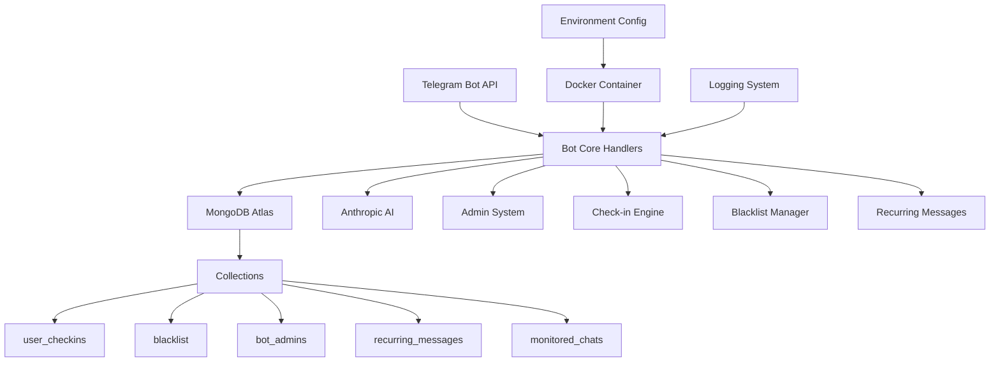

# System Patterns

## Architecture Overview ✅
O sistema segue uma arquitetura modular orientada a microserviços com separação clara de responsabilidades, otimizada para deployment em produção:

### Production Architecture
```
Telegram API ↔ Bot Core ↔ MongoDB Atlas
                    ↕
               Anthropic AI
                    ↕
            Logging & Monitoring
```

### Core Components ✅
- **Bot Core**: Gerencia interações com Telegram API e orquestração
- **Database Layer**: MongoDB Atlas com operações assíncronas
- **AI Integration**: Anthropic Claude para respostas contextuais
- **Admin System**: Controles administrativos e moderação
- **Check-in Engine**: Sistema de gamificação e pontuação
- **Blacklist Manager**: Moderação automática inteligente
- **Recurring Messages**: Agendamento e automação de mensagens
- **Monitoring System**: Logging estruturado e observabilidade

## Key Technical Decisions ✅
1. **Database**: **MongoDB Atlas** para escalabilidade cloud e flexibilidade
2. **Containerization**: **Docker** para deployment consistente e escalável
3. **AI Integration**: **Anthropic Claude** para respostas inteligentes
4. **Architecture**: **Modular** com separação clara de responsabilidades
5. **Environment**: **Production-ready** com configuração .env segura
6. **Security**: **Best practices** com usuário não-root e tokens seguros
7. **Monitoring**: **Structured logging** para debugging e observabilidade

## Design Patterns Implemented ✅
1. **Repository Pattern**: Para operações de banco de dados (MongoDB client)
2. **Command Pattern**: Para comandos do bot (handlers modulares)
3. **Observer Pattern**: Para eventos e notificações
4. **Strategy Pattern**: Para diferentes tipos de resposta (IA vs estática)
5. **Factory Pattern**: Para criação de mensagens contextuais
6. **Singleton Pattern**: Para conexões de banco e cliente AI
7. **Async Pattern**: Para operações não-bloqueantes

## Component Relationships ✅


## Data Flow ✅
### User Interaction Flow
1. **User Action** → Telegram sends update to bot
2. **Bot Processing** → Handler processes command/message
3. **Database Query** → MongoDB Atlas operations (async)
4. **AI Processing** → Anthropic API for intelligent responses (if needed)
5. **Response Generation** → Contextual response created
6. **Telegram Response** → Message sent back to user
7. **Logging** → Action logged for monitoring

### Admin Operations Flow
1. **Admin Command** → Verified against admin list
2. **Authorization** → Permission check in MongoDB
3. **Operation Execution** → Database/system modification
4. **Notification** → Confirmation to admin
5. **Audit Log** → Action logged for tracking

## Error Handling Strategy ✅
### Production-Grade Error Handling
- **Comprehensive Error Catching**: Try-catch em todas as operações críticas
- **Graceful Degradation**: Sistema continua funcionando mesmo com falhas parciais
- **User-Friendly Feedback**: Mensagens claras para usuários
- **Detailed Logging**: Logs estruturados para debugging
- **Recovery Mechanisms**: Retry logic para operações falhadas
- **Monitoring Integration**: Alertas para erros críticos

### Error Categories
1. **Database Errors**: Connection issues, query failures
2. **API Errors**: Telegram/Anthropic API issues
3. **User Input Errors**: Invalid commands, malformed data
4. **System Errors**: Container, memory, network issues
5. **Business Logic Errors**: Validation failures, conflicts

## Testing Strategy ✅
### Multi-Layer Testing Approach
- **Unit Tests**: Componentes individuais (pytest)
- **Integration Tests**: Fluxos end-to-end
- **Production Testing**: Validação em ambiente real
- **Performance Tests**: Load testing e otimização
- **Security Tests**: Validation de entrada e autorização
- **Regression Tests**: Prevenção de regressões

### Test Coverage Areas
1. **Database Operations**: CRUD operations, migrations
2. **Bot Commands**: All command handlers
3. **AI Integration**: Response generation and context
4. **Admin Functions**: Permission and operation validation
5. **Error Scenarios**: Edge cases and failure modes

## Performance Patterns ✅
### Optimization Strategies
1. **Async Operations**: Non-blocking database and API calls
2. **Connection Pooling**: Efficient MongoDB connections
3. **Query Optimization**: Indexed queries and aggregation pipelines
4. **Caching**: Reduced redundant API calls
5. **Batching**: Bulk operations for efficiency
6. **Resource Management**: Optimized memory and CPU usage

### Scalability Patterns
1. **Horizontal Scaling**: Container replication ready
2. **Database Sharding**: MongoDB Atlas auto-scaling
3. **Load Distribution**: Async processing distribution
4. **Resource Monitoring**: Proactive scaling triggers

## Security Patterns ✅
### Security Implementation
1. **Environment Security**: Secure .env variable management
2. **Container Security**: Non-root user, minimal attack surface
3. **Database Security**: MongoDB Atlas security features
4. **API Security**: Secure token and key management
5. **Input Validation**: Comprehensive sanitization
6. **Authorization**: Role-based admin access
7. **Audit Logging**: Complete action tracking

### Security Layers
```
User Input → Validation → Authorization → Operation → Audit Log
     ↓            ↓            ↓           ↓         ↓
   Sanitize   Permission   Database    Secure     Monitor
              Check        Access      Response
```

## Monitoring & Observability Patterns ✅
### Comprehensive Monitoring
1. **Structured Logging**: JSON-formatted logs with context
2. **Real-time Monitoring**: Live log streaming
3. **Performance Metrics**: Response time and throughput
4. **Error Tracking**: Exception monitoring and alerting
5. **Health Checks**: Container and service health
6. **Usage Analytics**: User interaction patterns

### Observability Stack
- **Application Logs**: Python logging framework
- **Container Logs**: Docker logging driver
- **Database Monitoring**: MongoDB Atlas metrics
- **External API Monitoring**: Rate limit and error tracking 